 
## Overview
Welcome to my <b>Relational Databases</b> project!\
I have developed a big desire to learn more about the Structured Query Language to develop SQL and NoSQL databases.
In this project I will be using my computer as the Localhost to store my files, and MySQL Workbench as my Database Management System.
The reason of why I am creating this software is to do data collection in my university (Brigham Young University - Idaho) catalog, to see the programs they offer per department and how many credits is each one of this individual programs.
I will be working through this project with INSERT, DELETE and UPDATE statements to work and manipulate my data.
I will also work with AGGREGATE functions, JOINS and filters targeting specific data types like DATETIME and YEAR!
Here is a video I recorded, where I go through each step to get this database up and running! including the logic behind my schema creation!

[Click Here to See My Relational Databases Demo Video](https://youtu.be/LPQw3-gk1bI)

## Relational Database

For this database I have created 8 tables:\
5 tables are for the course information:
* department
* catalog_year
* course
* program type
* field
* student has course

2 tables are for the student information:
* student
* address

I will explain in detail in the following PowerPoint slides each one of this tables, along with all the SQL queries I wrote to manipulate the data! 

## Development Environment

* DBMS (Database Management System): MySQL Workbench by Microsoft
* Programming Language: SQL

## Useful Websites

* [Master SQL with Codecademy Pro](https://try.codecademy.com/language-sql?utm_source=google&utm_medium=paid-search&utm_campaign=postclick&utm_content=language-sql&utm_source=google&utm_medium=paid-search&utm_campaign=postclick&utm_content=language-sql&gclid=Cj0KCQjwhY-aBhCUARIsALNIC07BRgwjxFJBbqXKr4Mmna6EHWIXOiinkSKdYJvHwWqEleuvEqypC_oaAkshEALw_wcB)
* [W3 Schools SQL Tutorial](https://www.w3schools.com/sql/)
* [Learn and Practice SQL](https://learnsql.com/)

## Future Work

* I would like to turn this project into a snowflake database model
* I would like to create automated jobs to retrieve specific queries based on a fixed schedule
* I would like to store this database in a cloud server
## My Project PowerPoint Presentation (with comments)
I have created a PowerPoint presentation to explain with detail my relational databases project.
<!-- I will use HTML tags to illustrate my PowerPoint Presentation with Photos -->

These are the 7 sections I will be covering during this project.

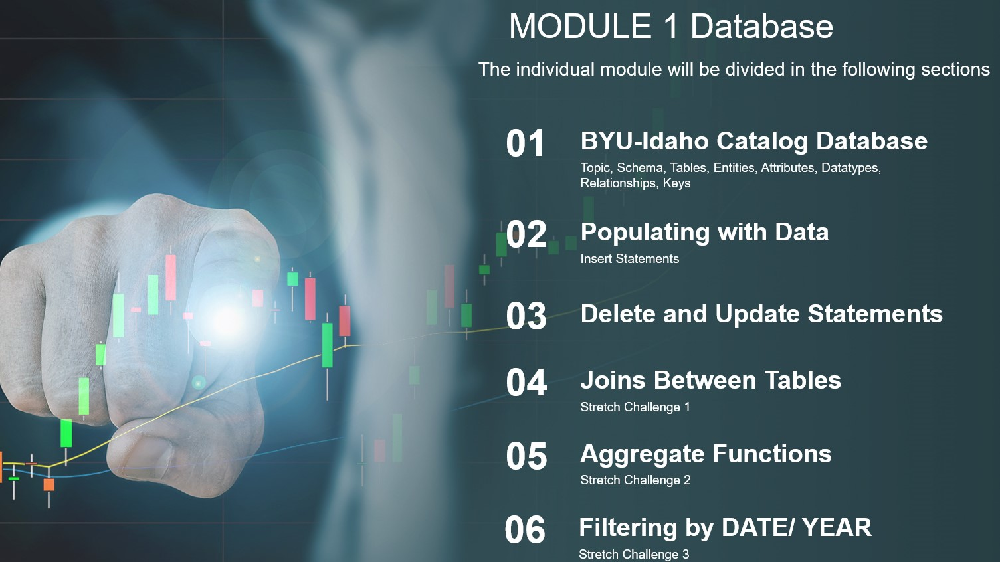

The data collection that I did was from the www.byui.edu/catalog#/programs, specifically from the department of "Computer Information Technology" and "Computer Science and Electrical Engineering".
I collected the department names, fields of study, program types, program codes and grand total credits.

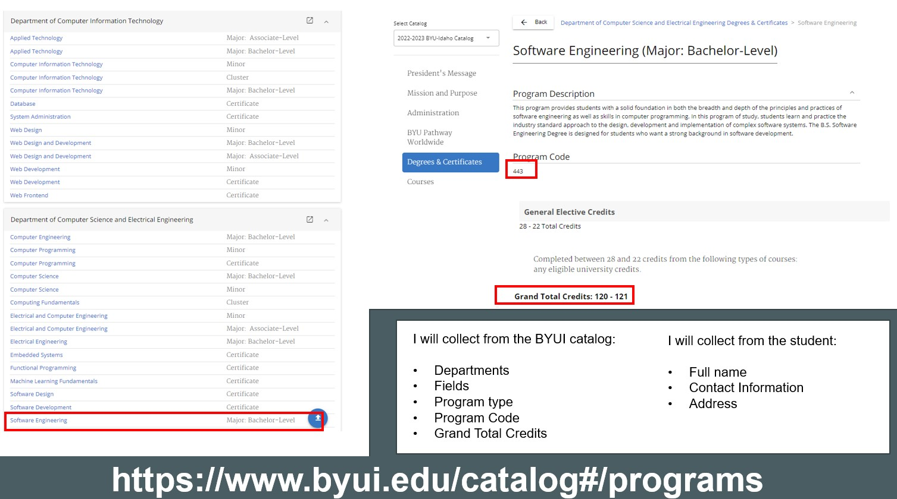

I have created these entities with attributes in this way to have a clean and professional diagram that follows all the DNF (Database Normal Forms).
I focus specially in the relationships (many-to-many, one-to-one and many-to-one) between my entities/ tables and the data types for my attributes.
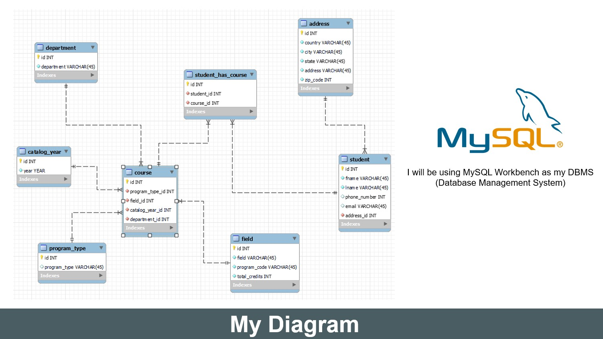

These two slides represent the INSERT statements that I used to populate each tables with the data I collected from the school catalog.

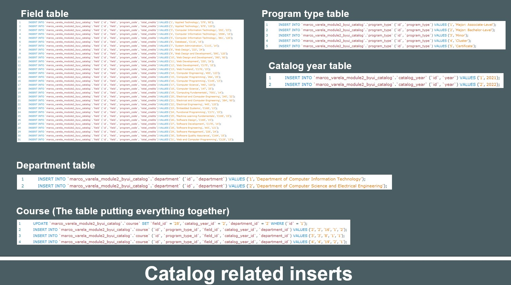
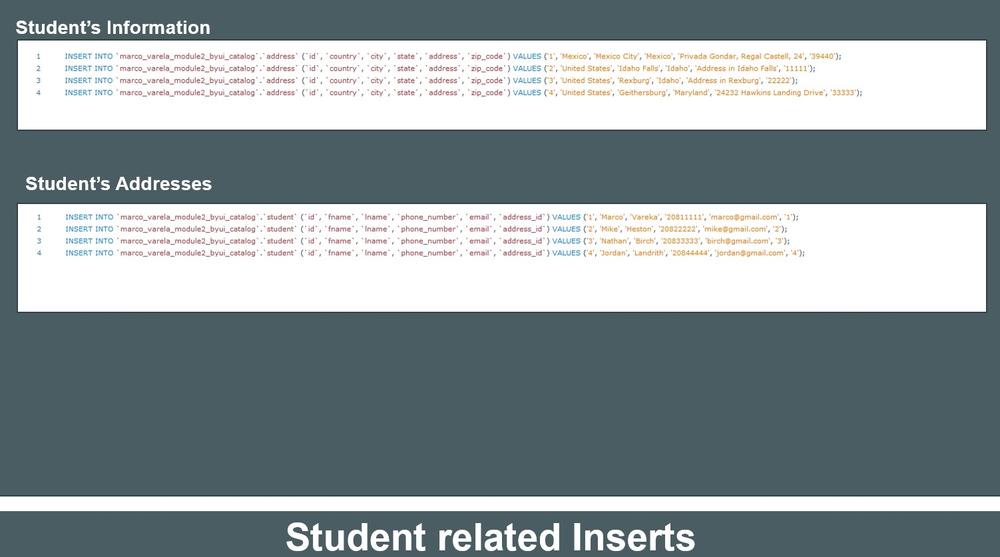
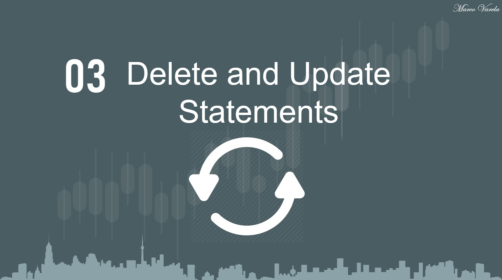

Let's learn more about this statements!
In the first 3 pictures on the left column, we can see how we are retrieving only 2 rows (2021 and 2022) from our catalog_year table, and then I used a INSERT INTO statement, to add 2 more entries (using the ID and year columns).\
Then on the right column I am using an UPDATE statement to alter one of the entries I just added and then I used a DELETE statement to delete the two entries I added for this example, to go back to the initial data, only the 2021 and 2022 years.

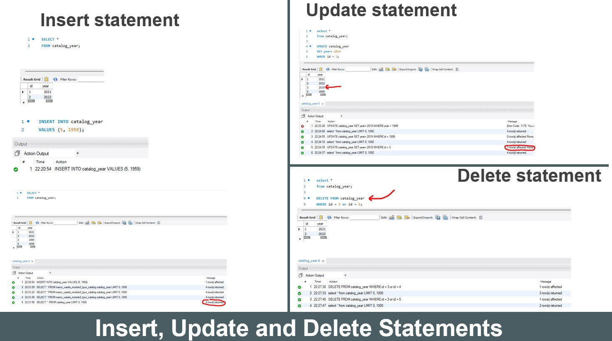

What happens if we want to display data from different tables?\
In this slide, I will show you how to use JOINS, to do this, we will use this order:
SELECT (the column names we want to display from all the tables we are using)
FROM (one table)
JOIN (the table connecting to our initial table)
ON (table1.primary key of table 1 = table2.primary key of table 2);

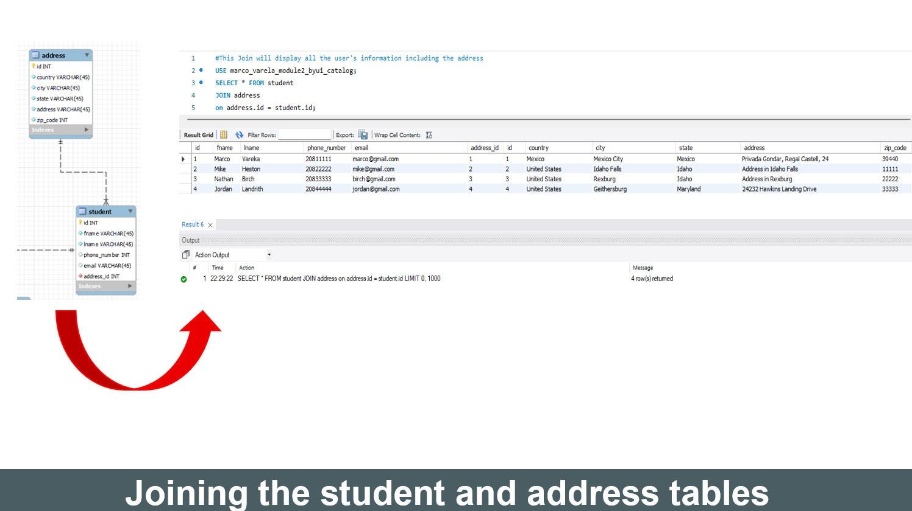

How many students come from the United States of America and from Mexico?
In the previous slides I added 4 students from 2 different countries, this SQL query will use a COUNT function to count the students per country and then they will be group by country and displayed in descendent order.

 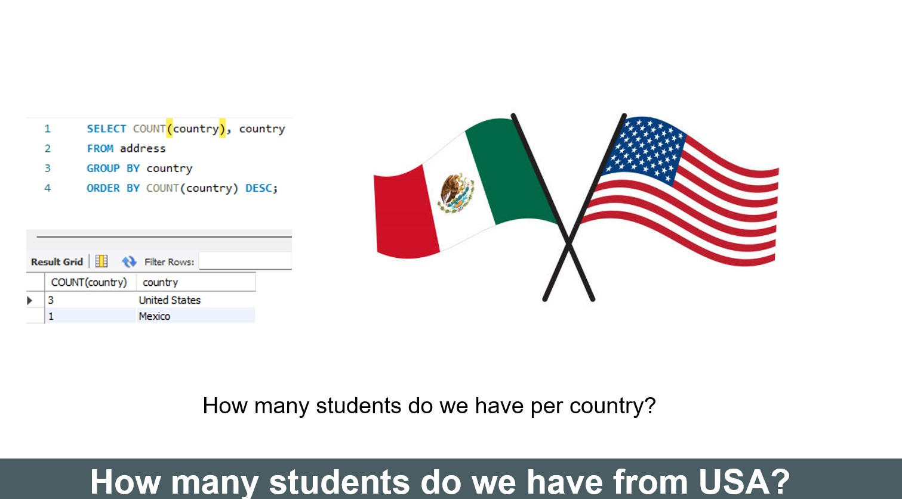

Let's use some aggregate functions and filter by the YEAR data type to know how many students are enrolled using the 2022 catalog!

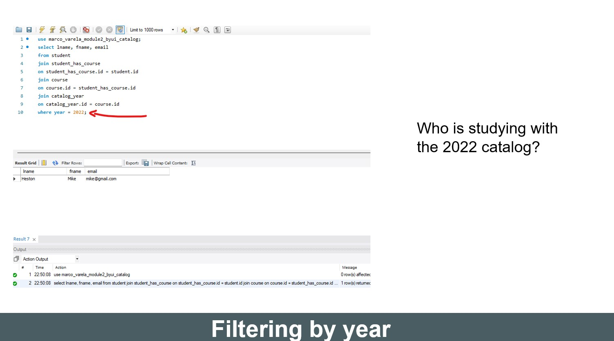
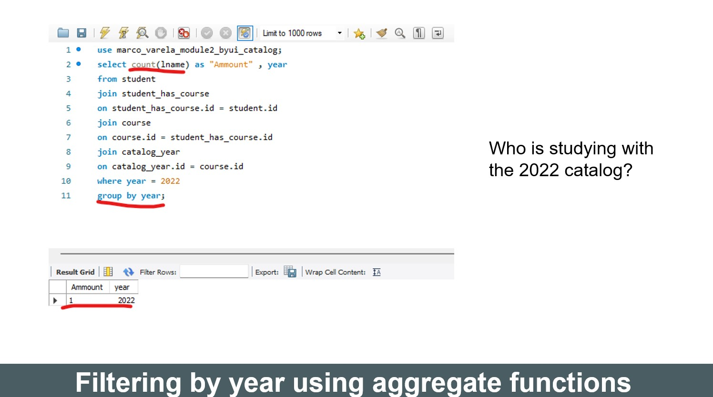