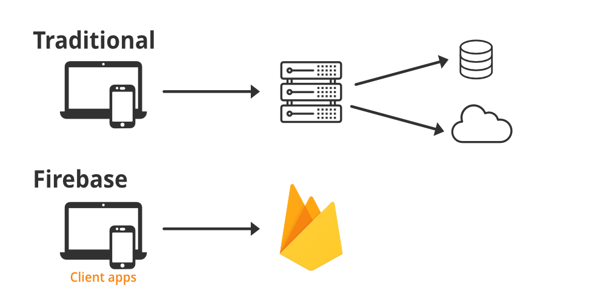

**[Click here to go back to the homepage](https://github.com/MarcoAntonioVarela/310_fall_2022)**
 
## Overview
Welcome to my <b>Cloud Databases</b> project!\
During this project I will be using the new version of Firebase 9 to create a database for my Mexican Restaurant!\
Firebase is what is know as a back end as a service, it provides back-end services like databases, authentication, file storage, cloud functions, hosting and other services as well that we can plug directly into our front-end applications or websites to make use of them.

During this project, I learned that the differences between the last version of Firebase (8) and Firebase 9 are that this new version adopts a more modular and functional approach, meaning that we only import the firebase functions that we need from the libraries and not those we do not need, in contrast, version 8 used a more object oriented approach (calling those functions on methods directly on Firebase objects).

### Getting started!

The first thing I needed to do for this project was to set up a module bundler like webpack in order to use the new firebase version.
I also needed to install node.js on my computer

[Click Here to See My Relational Databases Demo Video](https://youtu.be/)

## Relational Database

For this database I have created 8 tables:

I will explain in detail in the following PowerPoint slides each one of this tables, along with all the SQL queries I wrote to manipulate the data! 

## Development Environment

* Firebase 9 (new version)
* Node.js 16.12.0 LTS

## Useful Websites

* [Youtube FireBase 9 Tutorial](https://www.youtube.com/watch?v=9zdvmgGsww0&list=PL4cUxeGkcC9jERUGvbudErNCeSZHWUVlb)
* [Official FireBase Tutorial](https://firebase.google.com/docs/firestore)
* [Get Started with Cloud Firestore](https://firebase.google.com/docs/firestore/quickstart)

## Future Work

* Type here
* Type Here
## My Project PowerPoint Presentation (with comments)
I have created a PowerPoint presentation to explain with detail my cloud databases project.
<!-- I will use HTML tags to illustrate my PowerPoint Presentation with Photos -->

