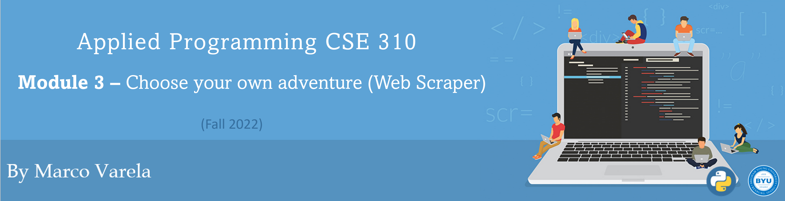
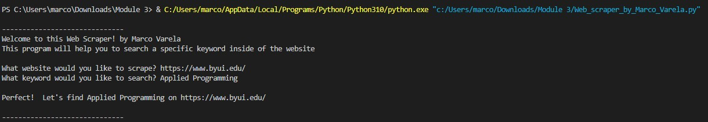
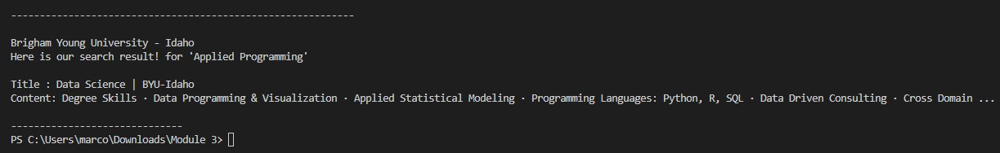

**[Click here to go back to the homepage](https://github.com/MarcoAntonioVarela/310_fall_2022)**
 
## Overview
Welcome! for this project I have created a great web scraper that will do automatic searches using the website and keywords provided by the user! then the program will display the search results in the console! 
Here are some screenshots the results of using https://www.byui.edu/ as my website to scrape, and "Applied Programming" as the provided keyword:





This is the website I used (https://www.byui.edu/):


[Click Here to See My Web Scraper Demo Video](https://youtu.be/H0vPOC9E1Ws)


## Development Environment

* I made the program using Python 3.10.0 64-bit
* I Installed the ChromeDriver for Windows 
* I used the "Selenium" Python web scraping library
* HTML5 and CSS3 to specify the elements that I am scraping with my Python program

## Useful Websites

* [Selenium with Python Documentation]([https://firebase.google.com/docs/firestore/quickstart](https://selenium-python.readthedocs.io/))
* [How to Use Selenium to Web-Scrape with Example]([https://www.youtube.com/watch?v=9zdvmgGsww0&list=PL4cUxeGkcC9jERUGvbudErNCeSZHWUVlb](https://towardsdatascience.com/how-to-use-selenium-to-web-scrape-with-example-80f9b23a843a))
* [Learn Selenium]([https://firebase.google.com/docs/firestore](https://saucelabs.com/platform/automation-tools/selenium?utm_source=adwords&utm_term=selenium%20automation&utm_medium=ppc&utm_campaign=&ad_id=587061692815&mt=e&src=g&ad_grp=142693717428&kw=selenium%20automation&campaign_id=16498595655&tgt=kwd-2087968505&gclid=Cj0KCQjwteOaBhDuARIsADBqRejVlv3OKdR37Df36iCcL1xK4Vj_Q8gHq8KFyFKzJZOvaLv6uhgc2tUaAnsXEALw_wcB))


## Future Work

* I would like to improve the user interface so it is more friendly and my program does not show in the console any code other than the expected outputs
* I would like to give the user the option to specify the amount of articles to be display
* I would like to use that given amount of articles to display input to loop through my page and display them in a nice format
* I would like to add an option to export that information in a file (Excel or CSV)
* 
## My Web Scraper Code 
Here is my code! I explain it all of it during my video! [Click Here to See My Web Scraper Demo Video](https://youtu.be/H0vPOC9E1Ws)

```
#Marco Varela
#Web Scraper Project

#I am importing the webdriver by selenium
from ast import keyword
from selenium import webdriver
#This import will help us to press the "Enter/ Return" key once we type the word in the search bar
from selenium.webdriver.common.keys import Keys
import time

#This imports will help me to tell Selenium to wait until an specific action is complete before moving on
from selenium.webdriver.common.by import By
from selenium.webdriver.support.ui import WebDriverWait
from selenium.webdriver.support import expected_conditions as EC

def main():
    intro()
    website = get_website()
    keyword = get_keyword()
    display_user_inputs(keyword,website)
    time.sleep(2)    
    scraper(website,keyword)
    


def intro():
    print()
    print("-" *30)
    print("Welcome to this Web Scraper! by Marco Varela")
    print("This program will help you to search a specific keyword inside of the website")
    print()
    

def get_website():
    website = str(input("What website would you like to scrape? "))
    return website
    
def get_keyword():
    keyword = str(input("What keyword would you like to search? "))
    return keyword

def display_user_inputs(keyword,website):
    print()
    print(f"Perfect!  Let's find {keyword} on {website}")
    print()
    print("-" *30)


def scraper(website,keyword):
    #I am specifying the path of the Google Chrome extension
    PATH = "C:\Program Files (x86)\chromedriver2.exe"
    driver = webdriver.Chrome(PATH)

    #This is the website I want to scrape, for this example I will use the school website
    driver.get(website)
    

    #Here I am specifying Selenium to interact with the search bar of the website
    #search = driver.find_element_by_id("search-byui")
    search = driver.find_element(by=By.ID, value="search-byui")

    #I am getting the title of the website
    site_title = driver.title

    #I am going to search "Software Engineering" from that search bar
    #I am adding time.sleep to see how the program is typing the word
    time.sleep(2)

    search.send_keys(keyword)
    search.send_keys(Keys.RETURN)

    search_title = driver.find_element(by=By.CLASS_NAME, value="gs-title")
    scraper_content = driver.find_element(by=By.CLASS_NAME, value="gsc-table-result")
    time.sleep(3)
    
    print()
    print()
    print()
    print()
    print("-" *60)
    print()
    #I am scraping the title of the website
    print(site_title)
    print(f"Here is our search result! for '{keyword}'" )
    print()
    print(f"Title : {search_title.text}")
    print(f"Content: {scraper_content.text}")
    print()
    print("-" *30)


main()
```
