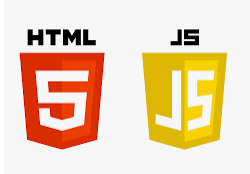
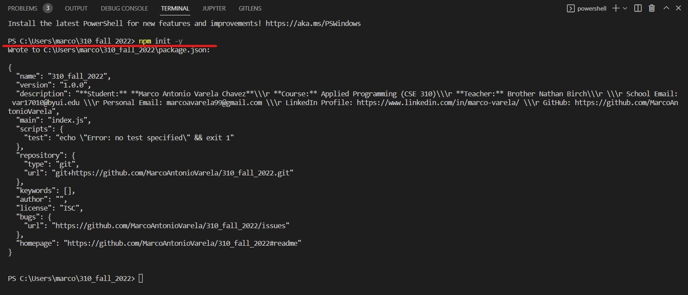
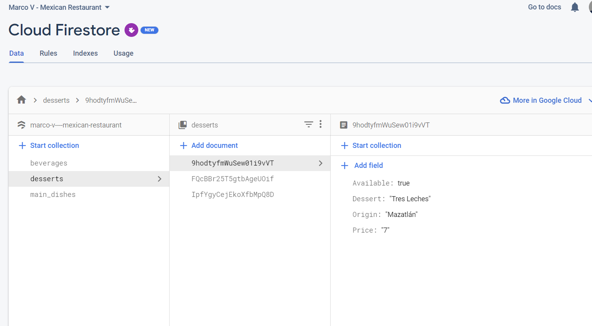

**[Click here to go back to the homepage](https://github.com/MarcoAntonioVarela/310_fall_2022)**
 
## Overview
Welcome to my <b>Cloud Databases</b> project!\
During this project I will be using the new version of Firebase 9 to create a database for my Mexican Restaurant! 
I also created a web application so the user can add and delete items from the database!
This is my web application:

During this project, I learned that the differences between the last version of Firebase (8) and Firebase 9 are that this new version adopts a more modular and functional approach, meaning that we only import the firebase functions that we need from the libraries and not those we do not need, in contrast, version 8 used a more object oriented approach (calling those functions on methods directly on Firebase objects).

### Getting started!

The first thing I needed to do for this project was to set up a module bundler like webpack in order to use the new firebase version.
I also needed to install node.js on my computer (Latest version: 16.17.1 (includes npm 8.15.0))

All the code I am using will be found in this "Module 2" section, in the ["Firebase_files"](https://github.com/MarcoAntonioVarela/310_fall_2022/tree/main/Module%202/Firebase_files) folder, that folder is divided into other two folders "src" folder, that will contain my JavaScript entry file, this is where I will be writing all of my JavaScript code.
And the "dist" folder contains my index.html file to create my webpage that will be connected to my bundled JavaScript. 

[Click here to see those files!](https://github.com/MarcoAntonioVarela/310_fall_2022/tree/main/Module%202/Firebase_files)

I also created a new package.json file to keep track of all of my different dependencies that I needed to install by typing npm init -y in my Visual Studio Code terminal:

I also needed to install webpack and webpack -cli by typing npm i webpack webpack-cli from my Visual Studio Code Terminal.

I also needed to install the Firebase package, by typing npm install Firebase in my Visual Studio Code Terminal

[Click Here to See My Cloud Databases Demo Video](https://www.youtube.com/watch?v=XFnW0BWkE94)

## Cloud Database Description

For this database I have created these collections and  to manipulate the data! 
One for the desserts, main dishes and beverages.
Each collection has documents (each document is either a meal, dessert or beverage)
And each document contains the following fields!
 

## Development Environment

* Firebase 9 (new version)
* Node.js 16.12.0 LTS Latest Version: 16.17.1 (includes npm 8.15.0)
* HTML 5 (To build the web app)

## Useful Websites

* [Youtube FireBase 9 Tutorial](https://www.youtube.com/watch?v=9zdvmgGsww0&list=PL4cUxeGkcC9jERUGvbudErNCeSZHWUVlb)
* [Official FireBase Tutorial](https://firebase.google.com/docs/firestore)
* [Get Started with Cloud Firestore](https://firebase.google.com/docs/firestore/quickstart)

## Future Work

* Add a display all the sections information in a professional and nice chart
* Add a feature to count how many items we have left, that will add or remove an item every time an item is being added to an order
* A feature that will calculate how much the client needs to pay depending the food he/ she is buying

