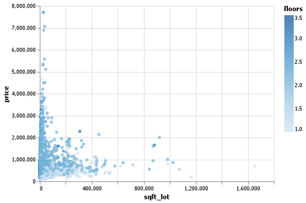
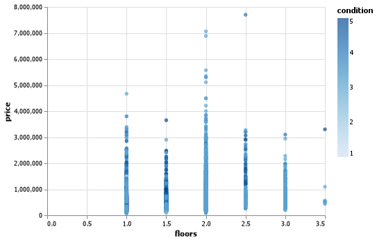
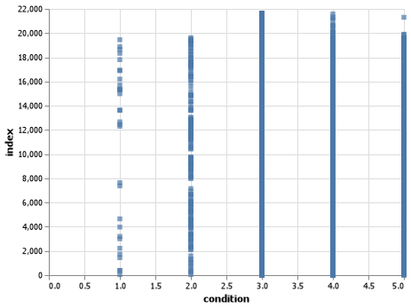

**[Click here to go back to the homepage](https://github.com/MarcoAntonioVarela/310_fall_2022)**
 

## Overview - Java Snake Game

In this project I used only the programming language Java to create a fun and exciting snake game!\
I coded more than 180 lines of code (between my both classes "Board.java" and "Snake.java") and used:
* Variables
* Expressions
* Conditionals
* Loops
* Functions
* Classes

This is how my game looks like while the user is playing it!

 


This is how my game looks like when the user looses...GAME OVER! 

 


[Click Here to See My Data Analysis Demo Video]()


## Development Environment

 
* Windows 11 (Dell XPS 15) 
* Visual Studio Code (Adapted for Java)
* Java

## Useful Websites

* [How to use Java with Visual Studio Code](https://ori.hhs.gov/education/products/n_illinois_u/datamanagement/datopic.html)
* [Library Software / Python / Data analysis](https://www.simplilearn.com/top-python-libraries-for-data-science-article)
* [pandas 1.5.1 documentation](https://pandas.pydata.org/docs/)
* [pandas - Python Data Analysis Library](https://pandas.pydata.org/)
* [Vega-Altair: Declarative Visualization in Python — Altair 4.2.0 Documentation](https://altair-viz.github.io/)

## Future Work

* I would like to learn how to group by specific categories using pandas
* I would like to learn how to use other charts, line a line graph, bar chart, pie chart
* I would like to know how to wrangle and clean my data better (I had problems with the date column because it was a string rather than a date datatype)
## My Questions and Code
Here is my code! I am using Python cells '# %%' to narrow my questions, answers and code.
I explain it all of it during my video! [Click Here to See My Data Analysis Demo Video]()

I am importing my Pandas and Altair library and creating a variable to store the URL with the dataset

```
# %%
#Housing Data Analysis by Marco Varela
import altair as alt
import pandas as pd
url = ("https://raw.githubusercontent.com/rashida048/Datasets/master/home_data.csv")
housing_data = pd.read_csv(url)

```

How big is my dataset?
How many rows do I have in my dataset? 21613 rows
How many columns do I have in my dataset? 21 columns

```
# %%
print("Showing all the data")
print(housing_data)
```

I had a problem! my ID column is not accurate, how can I clean and reset my ID/indexes? 

```
# %%
print("I will reset our dataset indexes")
housing_data = housing_data.reset_index()
print(housing_data)
```

Question: What is the cheapest house? 
Answer: Price $75000, with no bathrooms, 1 bedroom and 670 square feet

```
# %%
print('What is the cheapest house?')
cheapest_house = housing_data[housing_data['price']==housing_data['price'].min()]
print(cheapest_house) 

```

Question: What is the most expensive house?
Answer: Price $7700000, with 8 full bathrooms, 6 bedrooms and  12050 square feet
```
print('What is the most expensive house?')
most_expensive_house = housing_data[housing_data['price']==housing_data['price'].max()]
print(most_expensive_house)
```

Question:What is the average house price
Answer: $540088.14

```
# %%
print("What is the average house price?")
average_house_price = housing_data["price"].mean()
print(average_house_price)
```

Question: What is the biggest house? (square feet)
Answer: 13540 square feet

```
# %%
print("What is the biggest house? (square feet)
biggest_house = housing_data["sqft_living"].max()
print(biggest_house)
```

Question: What is the smallest size? (square feet)
Answer: 290 square feet

```
# %%
print("What is the smallest size? (square feet)
smallest_house = housing_data["sqft_living"].min()
print(smallest_house)
```

Question: What is the average house size? (square feet)
Answer: 2079.89 square feet

```
# %%
print("What is the average house size? (square feet)
average_house_size = housing_data["sqft_living"].mean()
print(average_house_price)
```

Question: What is the correlation between the house size and the price?
Chart: 

 

```
# %%
print('What is the correlation between the house size and the price?')
chart = (alt.Chart(housing_data)
  .encode(
    x ='sqft_lot',
    y='price',
    color = 'floors')
  .mark_circle()
)
chart.save("Charts/size_prices.png")
```

Question: How many houses have 1 floor?
Answer: From 21613 houses, 10680 have 1 floor

```
# %%
print("How many houses have 1 floor?")
number_of_houses = '21613'
has_1_floor = housing_data[housing_data["floors"] == 1].count()
print(f'From {number_of_houses}, there are {has_1_floor} houses with 1 floor')

```


Question: How many houses have 2 floors?
Answer: From 21613 houses, 8241 have 2 floors

```
# %%
print("How many houses have 2 floors?")
number_of_houses = '21613'
has_1_floor = housing_data[housing_data["floors"] == 2].count()
print(f'From {number_of_houses}, there are {has_1_floor} houses with 2 floors')


```

Question: How many houses have 3 floors?
Answer: From 21613 houses, 613 have 3 floors

```
# %%
print("How many houses have 3 floors?")
number_of_houses = '21613'
has_1_floor = housing_data[housing_data["floors"] == 3].count()
print(f'From {number_of_houses}, there are {has_1_floor} houses with 3 floors')

```

Question: Are 2-floor and 3-floor houses more expensive than 1-floor houses?
Answer: Yes, after making this chart, I saw that the most expensive houses are the ones with 2 floors
Chart:

 

```
# %%
print('Are 2-floor and 3-floor houses more expensive than 1-floor houses?')
chart = (alt.Chart(housing_data)
  .encode(
    x ='floors',
    y='price',
    color = 'condition')
  .mark_circle()
)
chart.save("Charts/floors_prices.png")

```

Question: What is the most predominant housing condition?
Answer: The dataset has a scale  from 0.0 to 5.0 to measure/ rate a house condition, and we can see this predominance in the housing condition
1) 3.0 is the most predominant condition (which indicates to be the average)
2) 4.0 
3) 5.0
4) 2.0
5) 1.0

Chart: 

 

```
# %%
print("What is the most predominant housing condition?")
chart = (alt.Chart(housing_data)
  .encode(
    x ='condition',
    y = 'index')
  .mark_square()
)
chart.save("Charts/housing_condition.png")
```


