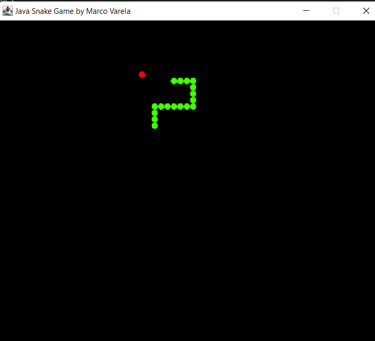
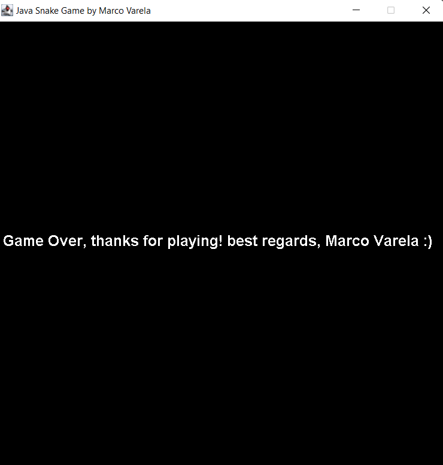

**[Click here to go back to the homepage](https://github.com/MarcoAntonioVarela/310_fall_2022)**
 

## Overview - Java Snake Game

Click here to see my folder with all of my code ---------> [Java Snake Game By Marco Varela](https://github.com/MarcoAntonioVarela/310_fall_2022/tree/main/Module%205/Marco_Varela_Java_Project)

In this project I used only the programming language Java to create a fun and exciting snake game! That will bring love, joy and adventure in my life!\
I coded more than 180 lines of code (between my both classes "Board.java" and "Snake.java") and used:
* Variables
* Expressions
* Conditionals
* Loops
* Functions
* Classes

My Java Snake game is excecuted from the class "Snake.java" and to play it you will need to use the up, down, left and right keyboards to move the snake twards the apple (red dot), you loose if you touch one of the board boarders or the same snake.

This is how my game looks like while the user is playing it!

 

This is how my game looks like when the user looses...GAME OVER! 

 

Click here to see my folder with all of my code ---------> [Java Snake Game By Marco Varela](https://github.com/MarcoAntonioVarela/310_fall_2022/tree/main/Module%205/Marco_Varela_Java_Project)

[Click Here to See My Data Analysis Demo Video](https://youtu.be/O37utmMThY0)

## Development Environment

 
* Windows 11 (Dell XPS 15) 
* Visual Studio Code (I integrated Java into it)
* Java

## Useful Websites

* [How to use Java with Visual Studio Code](https://ori.hhs.gov/education/products/n_illinois_u/datamanagement/datopic.html)
* [Java Tutorial - W3Schools](https://www.google.com/search?q=java+tutorial&rlz=1C1VDKB_enUS982US982&oq=java+tutorial+&aqs=chrome..69i57j0i512l4j0i10i433i512j69i60j69i61.2803j0j4&sourceid=chrome&ie=UTF-8#:~:text=Java%20Tutorial%20%2D%20W3Schools)
* [How To Use Classes in Java - YouTube](https://www.google.com/search?q=java+tutorial+classes&rlz=1C1VDKB_enUS982US982&sxsrf=ALiCzsbYa99qX6k2GQg5Wrkjw7_N74tavw%3A1669191445060&ei=Fdd9Y4CkA9GpqtsPlo-LyAg&ved=0ahUKEwjAgpTZ7sP7AhXRlGoFHZbHAokQ4dUDCBE&uact=5&oq=java+tutorial+classes&gs_lcp=Cgxnd3Mtd2l6LXNlcnAQAzIFCAAQgAQyBggAEBYQHjIKCAAQFhAeEA8QCjIGCAAQFhAeMgYIABAWEB4yBggAEBYQHjIGCAAQFhAeMgYIABAWEB4yBggAEBYQHjIGCAAQFhAeOgoIABBHENYEELADOgcIABCwAxBDOg0IABDkAhDWBBCwAxgBOgwILhDIAxCwAxBDGAI6BAgAEEM6BwgAEIAEEAo6CggAEIAEELEDEAo6BQgAEJECSgQIQRgASgQIRhgBUJ4HWJwOYPQOaAFwAXgAgAFniAHnBJIBAzYuMZgBAKABAcgBEcABAdoBBggBEAEYCdoBBggCEAEYCA&sclient=gws-wiz-serp#:~:text=How%20To%20Use%20Classes%20in%20Java%20%2D%20YouTube)
* [Java - Object and Classes - Tutorialspoint](https://www.google.com/search?q=java+tutorial+classes&rlz=1C1VDKB_enUS982US982&sxsrf=ALiCzsbYa99qX6k2GQg5Wrkjw7_N74tavw%3A1669191445060&ei=Fdd9Y4CkA9GpqtsPlo-LyAg&ved=0ahUKEwjAgpTZ7sP7AhXRlGoFHZbHAokQ4dUDCBE&uact=5&oq=java+tutorial+classes&gs_lcp=Cgxnd3Mtd2l6LXNlcnAQAzIFCAAQgAQyBggAEBYQHjIKCAAQFhAeEA8QCjIGCAAQFhAeMgYIABAWEB4yBggAEBYQHjIGCAAQFhAeMgYIABAWEB4yBggAEBYQHjIGCAAQFhAeOgoIABBHENYEELADOgcIABCwAxBDOg0IABDkAhDWBBCwAxgBOgwILhDIAxCwAxBDGAI6BAgAEEM6BwgAEIAEEAo6CggAEIAEELEDEAo6BQgAEJECSgQIQRgASgQIRhgBUJ4HWJwOYPQOaAFwAXgAgAFniAHnBJIBAzYuMZgBAKABAcgBEcABAdoBBggBEAEYCdoBBggCEAEYCA&sclient=gws-wiz-serp#:~:text=Java%20%2D%20Object%20and%20Classes%20%2D%20Tutorialspoint)
* [Java Class and Objects (With Example) - Programiz](https://www.programiz.com/java-programming/class-objects)

## Future Work

* Make my game bigger, add better graphics (a real snake and a real apple)
* Add sound when the game starts, the snake eats an apple and game over
* Add a score counter for each apple the snake eats
* Keep track of the user and score to display the user with the highest score so far
