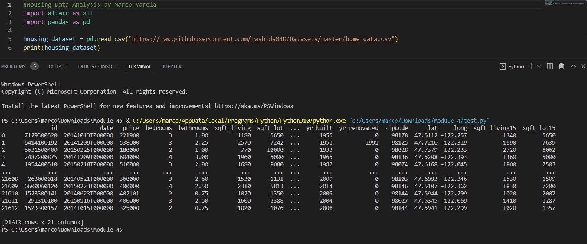

**[Click here to go back to the homepage](https://github.com/MarcoAntonioVarela/310_fall_2022)**
 
## Overview
Welcome! I will work on data analysis project, by exploring  the "Housing Price" dataset (provided by https://towardsdatascience.com/), [click here to learn more about this data set](https://raw.githubusercontent.com/rashida048/Datasets/master/home_data.csv)

 

The structure (columns) of this dataset is the following:
id, date, price, bedrooms, bathrooms, sqft_living, sqft_lot, floors, waterfront, view, condition, grade, sqft_above, sqft_basement, yr_built, yr_renovated, zip code, lat, long, sqft_living15, sqft_lot15.


While analyzing this data set, I will focus on answering important questions (I will show them with the code I used to answer them at the bottom of this document)


I installed and used 2 Python libraries to analyze this data set:
* Pandas (Pandas is a software library written for the Python programming language for data manipulation and analysis. In particular, it offers data structures and operations for manipulating numerical tables and time series.)
* Altair (Altair is a declarative statistical visualization library for Python. It provides several features to perform data analysis while creating stunning visualizations)

To install this two Python libraries on my computer I needed to run this code in my terminal:

```
pip install altair
pip install pandas
```


This is how my dataset looks like:

 


[Click Here to See My Data Analysis Demo Video]()


## Development Environment

 
Windows 11 (Dell XPS 15) |Python 3.10.0 64-bit     |   Pandas Python Library  | Altair Python (a statistical visualization library for Python)|
:-----------------------:|:-----------------------:|:-----------------------: |:-----------------------: |
 | |  | |


## Useful Websites

* [Data Analysis - The Office of Research Integrity](https://ori.hhs.gov/education/products/n_illinois_u/datamanagement/datopic.html)
* [Library Software / Python / Data analysis](https://www.simplilearn.com/top-python-libraries-for-data-science-article)
* [pandas 1.5.1 documentation](https://pandas.pydata.org/docs/)
* [pandas - Python Data Analysis Library](https://pandas.pydata.org/)
* [Vega-Altair: Declarative Visualization in Python — Altair 4.2.0 Documentation](https://altair-viz.github.io/)

## Future Work

* I would like to learn how to group by specific categories using pandas
* I would like to learn how to use other charts, line a line graph, bar chart, pie chart
* I would like to know how to wrangle and clean my data better (I had problems with the date column because it was a string rather than a date datatype)
